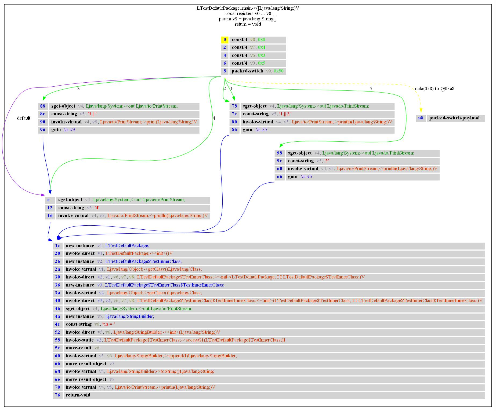

.. _bb:

Basic Blocks
============

We already saw the concept of xrefs_, which can be used to get references in the assembly.
The next step is to look at the Control Flow Graph (CFG) of a method.

Such a CFG can be generated using the `decompile` command of the androguard_ tool.
Let's take the androguard example file and decompile it:

.. code-block:: none

    $ androguard decompile -d output_folder -f jpg --limit "LTestDefaultPackage.*" examples/android/TestsAndroguard/bin/TestActivity.apk
    [INFO    ] androguard.analysis: End of creating cross references (XREF)
    [INFO    ] androguard.analysis: run time: 0min 00s
    Dump information examples/android/TestsAndroguard/bin/TestActivity.apk in output_folder
    Create directory output_folder
    Decompilation ... End
    Dump LTestDefaultPackage$TestInnerClass$TestInnerInnerClass; <init> (LTestDefaultPackage$TestInnerClass; I I)V ... jpg ... source codes ... bytecodes ...
    Dump LTestDefaultPackage$TestInnerClass$TestInnerInnerClass; <init> (LTestDefaultPackage$TestInnerClass; I I LTestDefaultPackage$TestInnerClass$TestInnerInnerClass;)V ... jpg ... bytecodes ...
    Dump LTestDefaultPackage$TestInnerClass$TestInnerInnerClass; Test (I)V ... jpg ... bytecodes ...
    Dump LTestDefaultPackage$TestInnerClass; <init> (LTestDefaultPackage; I I)V ... jpg ... source codes ... bytecodes ...
    Dump LTestDefaultPackage$TestInnerClass; <init> (LTestDefaultPackage; I I LTestDefaultPackage$TestInnerClass;)V ... jpg ... bytecodes ...
    Dump LTestDefaultPackage$TestInnerClass; access$1 (LTestDefaultPackage$TestInnerClass;)I ... jpg ... bytecodes ...
    Dump LTestDefaultPackage$TestInnerClass; Test (I)V ... jpg ... bytecodes ...
    Dump LTestDefaultPackage; <init> ()V ... jpg ... source codes ... bytecodes ...
    Dump LTestDefaultPackage; main ([Ljava/lang/String;)V ... jpg ... bytecodes ...
    Dump LTestDefaultPackage; const4 ()V ... jpg ... bytecodes ...

Note, that we only decompiled a certain subset of the file, as we are not interested in the other classes right now.

Inside the output folder, we have now several files, among them some JPG files which show the CFG, like this one:

Each of the rectangles is a :class:`~androguard.core.analysis.analysis.DVMBasicBlock`.
Each block is connected via an arrow, indicating the flow direction.

In this example, we can see that the `switch` instruction has six different ways to go,
indicated by the green and purple arrows. Each green arrow is a specific check inside the `switch` instruction,
i.e. what value results in which code block. The purple arrow is the default case.
We can see that the `switch` only results in four different code blocks.
There is a special block, with the yellow arrow, which is the pseudo instruction holding the switch payload.

Each of the switch blocks is followed by another, large basic block.
If you look carefully, you can see that three of the blocks have `goto` commands at the end but the fourth block does not
have one.
First, take a look at the overall disassembly of the method:

.. code-block:: none

    METHOD LTestDefaultPackage; public static main ([Ljava/lang/String; v9)V
    main-BB@0x00000000 :
            0  (00000000) const/4             v8, 0
            1  (00000002) const/4             v7, 4
            2  (00000004) const/4             v6, 3
            3  (00000006) const/4             v0, 5
            4  (00000008) packed-switch       v0, 80 [ D:main-BB@0x0000000e 1:main-BB@0x00000078 2:main-BB@0x00000078 3:main-BB@0x00000088 4:main-BB@0x0000000e 5:main-BB@0x00000098 ]
            5  (0000000e) sget-object         v4, Ljava/lang/System;->out Ljava/io/PrintStream;
            6  (00000012) const-string        v5, '4'
            7  (00000016) invoke-virtual      v4, v5, Ljava/io/PrintStream;->println(Ljava/lang/String;)V [ main-BB@0x0000001c ]
            8  (0000001c) new-instance        v1, LTestDefaultPackage;
            9  (00000020) invoke-direct       v1, LTestDefaultPackage;-><init>()V
            10 (00000026) new-instance        v2, LTestDefaultPackage$TestInnerClass;
            11 (0000002a) invoke-virtual      v1, Ljava/lang/Object;->getClass()Ljava/lang/Class;
            12 (00000030) invoke-direct       v2, v1, v6, v7, v8, LTestDefaultPackage$TestInnerClass;-><init>(LTestDefaultPackage; I I LTestDefaultPackage$TestInnerClass;)V
            13 (00000036) new-instance        v3, LTestDefaultPackage$TestInnerClass$TestInnerInnerClass;
            14 (0000003a) invoke-virtual      v2, Ljava/lang/Object;->getClass()Ljava/lang/Class;
            15 (00000040) invoke-direct       v3, v2, v6, v7, v8, LTestDefaultPackage$TestInnerClass$TestInnerInnerClass;-><init>(LTestDefaultPackage$TestInnerClass; I I LTestDefaultPackage$TestInnerClass$TestInnerInnerClass;)V
            16 (00000046) sget-object         v4, Ljava/lang/System;->out Ljava/io/PrintStream;
            17 (0000004a) new-instance        v5, Ljava/lang/StringBuilder;
            18 (0000004e) const-string        v6, 't.a = '
            19 (00000052) invoke-direct       v5, v6, Ljava/lang/StringBuilder;-><init>(Ljava/lang/String;)V
            20 (00000058) invoke-static       v2, LTestDefaultPackage$TestInnerClass;->access$1(LTestDefaultPackage$TestInnerClass;)I
            21 (0000005e) move-result         v6
            22 (00000060) invoke-virtual      v5, v6, Ljava/lang/StringBuilder;->append(I)Ljava/lang/StringBuilder;
            23 (00000066) move-result-object  v5
            24 (00000068) invoke-virtual      v5, Ljava/lang/StringBuilder;->toString()Ljava/lang/String;
            25 (0000006e) move-result-object  v5
            26 (00000070) invoke-virtual      v4, v5, Ljava/io/PrintStream;->println(Ljava/lang/String;)V
            27 (00000076) return-void
            28 (00000078) sget-object         v4, Ljava/lang/System;->out Ljava/io/PrintStream;
            29 (0000007c) const-string        v5, '1 || 2'
            30 (00000080) invoke-virtual      v4, v5, Ljava/io/PrintStream;->println(Ljava/lang/String;)V
            31 (00000086) goto                -53 [ main-BB@0x0000001c ]
            32 (00000088) sget-object         v4, Ljava/lang/System;->out Ljava/io/PrintStream;
            33 (0000008c) const-string        v5, '3 || '
            34 (00000090) invoke-virtual      v4, v5, Ljava/io/PrintStream;->print(Ljava/lang/String;)V
            35 (00000096) goto                -68 [ main-BB@0x0000000e ]
            36 (00000098) sget-object         v4, Ljava/lang/System;->out Ljava/io/PrintStream;
            37 (0000009c) const-string        v5, '5'
            38 (000000a0) invoke-virtual      v4, v5, Ljava/io/PrintStream;->println(Ljava/lang/String;)V
            39 (000000a6) goto                -69 [ main-BB@0x0000001c ]
            40 (000000a8) packed-switch-payload

All these blocks are concatenated to each other. If you like, try to identify the basic blocks inside the disassembly!
Hint: The second column gives the offset inside the bytecode and matches the offset given in the CFG.

As you can see, the order of instructions in the bytecode does not match the execution order.
For example, the `return` opcode is in the middle of the bytecode, while it is the end of the execution.
Therefore some parts must have a `goto` to resume the execution at the correct point.
For example, the basic block for the case that the argument of the switch opcode is :code:`5` ends at offset 0xa6
and has a goto command to subtract 0x45 from the current offset.
But that ends up being offset 0x61? No, it does not. To increase your confusion, you have to know,
that offset arguments for opcodes are always in 16-bit units, while the offset used by androguard are counted in 8-bit units.
That means, that you have to subtract 0x8a, which indeed returns to offset 0x1c in the bytecode.

.. warning::

    The offset units used are sometimes a little bit inconsistent across androguard!
    If you find some inconsistent behavior, please report it as an issue.

To conclude, let's take a look at the actual Java source code of this particular method:

.. code-block:: java

    public static void main(String [] z) {
        int a = 5;
        switch(a)
        {
        case 1:
        case 2:
            System.out.println("1 || 2");
            break;
        case 3:
            System.out.print("3 || ");
        case 4:
        default:
            System.out.println("4");
            break;
        case 5:
            System.out.println("5");
        }
        TestDefaultPackage p = new TestDefaultPackage();
        TestInnerClass t = p.new TestInnerClass(3, 4);
        TestInnerClass.TestInnerInnerClass t2 = t.new TestInnerInnerClass(3, 4);
        System.out.println("t.a = " + t.a);
    }

Can you see how each Basic block belongs to a different path in the code?
