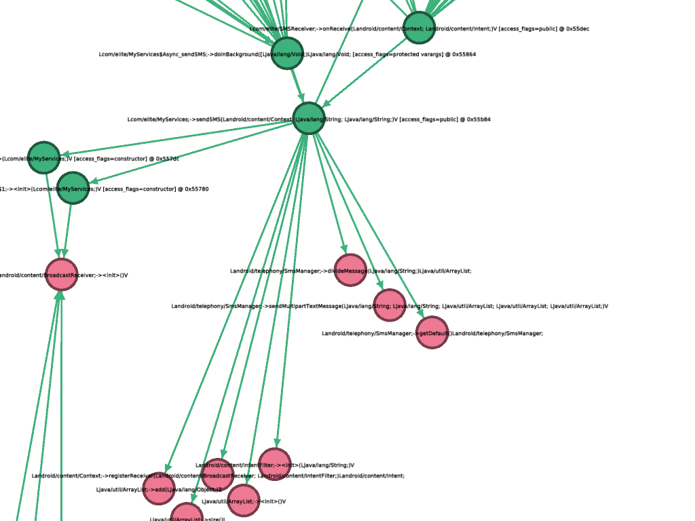

androguard cg - Create Call Graph from APK
==========================================

androcg can create files that can be read using graph visualization software, for example gephi_.

Synopsis
--------

.. program-output:: androguard cg --help

Examples
--------

The call graph is constructed from the
:class:`~androguard.analysis.analysis.Analysis` object and then converted into a
networkx `MultiDiGraph`. Currently supported formats are gml, gexf, gpickle, graphml, yaml and net.

The call graph contains methods as nodes and calls as edges. Each edge has the
offset inside the method stored as an attribute and multiple calls between two
methods result in multiple edges.

The methods to construct the callgraph from can be filtered. It is highly
suggested to do that, as call graphs can get very large:

.. image:: screenshot_182338.png

Of course, you can export the call graph with androguard and filter it later.
If you filter with androguard, calls to this method will be stored, as well as
calls from the method.
For external methods only the first direction can be saved.

.. note::
   External methods are not automatically API methods!
   It might be the case, that the method in question could not be found during
   disassembly time, hence it is stored as external.

Here is an example of an already filtered graph, visualized in gephi_.
Each node has an attribute to indicate if it is an internal (defined somewhere
in the DEXs) or external (might be an API, but definitely not defined in the DEXs) method.
In this case all green nodes are internal and all red ones are external.
You can see the calls of some SMS Trojan to the API methods to write SMS.

.. _gephi: https://gephi.org/

