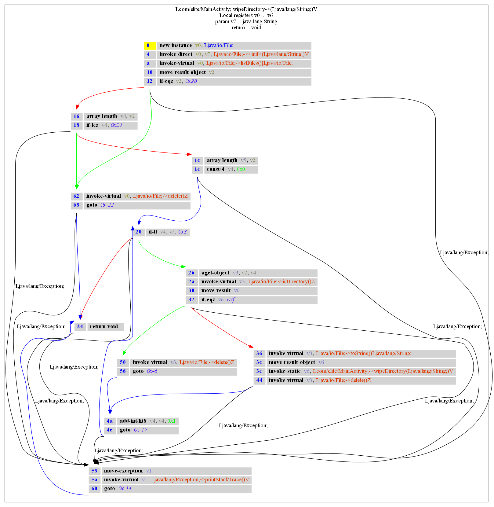

androguard decompile - Decompile APKs and create CFG
====================================================

androdd is a tool to create a decompiled version of an APK using the available decompilers.

Synopsis
--------

.. program-output:: androguard decompile --help

It also can generate control flow graphs (CFG) for each method using the graphviz format.
The CFGs can be exported as image file directly.

Additionally to the decompiled classes in .java format, each method is given in a SMALI like format (.ag files)

All filenames are sanitized, so they should work on most operating systems and filesystems.

Examples
--------

To get all CFG in png format and limit the processing only to a certain namespace, the following command can be used:

.. code-block:: bash

    androguard decompile -o outputfolder -f png -i someapp.apk --limit "^Lcom/elite/.*"
    
Please make sure that graphviz and pydot are installed.

.. code-block:: bash

    $ sudo apt-get install graphviz
    $ pip install -U pydot

This will decompile the app `someapp.apk` into the folder `outputfolder` and limit the processing to all methods, where
the classname starts with `com.elite.`.

A CFG might look like this:

while the `.ag` file has this content:

.. code-block:: guess

    # Lcom/elite/MainActivity;->wipeDirectory(Ljava/lang/String;)V [access_flags=private static]
    #
    # Parameters:
    # - local registers: v0...v6
    # - v7:java.lang.String
    #
    # - return:void

    wipeDirectory-BB@0x0 : [ wipeDirectory-BB@0x16 wipeDirectory-BB@0x62 ]
        0       (00000000) new-instance         v0, Ljava/io/File;
        1       (00000004) invoke-direct        v0, v7, Ljava/io/File;-><init>(Ljava/lang/String;)V
        2       (0000000a) invoke-virtual       v0, Ljava/io/File;->listFiles()[Ljava/io/File;
        3       (00000010) move-result-object   v2
        4       (00000012) if-eqz               v2, +28
        0:55
        (Ljava/lang/Exception; -> 58 wipeDirectory-BB@0x58)

    wipeDirectory-BB@0x16 : [ wipeDirectory-BB@0x1c wipeDirectory-BB@0x62 ]
        5       (00000016) array-length         v4, v2
        6       (00000018) if-lez               v4, +25
        0:55
        (Ljava/lang/Exception; -> 58 wipeDirectory-BB@0x58)

    wipeDirectory-BB@0x1c : [ wipeDirectory-BB@0x20 ]
        7       (0000001c) array-length         v5, v2
        8       (0000001e) const/4              v4, 0
        0:55
        (Ljava/lang/Exception; -> 58 wipeDirectory-BB@0x58)

    wipeDirectory-BB@0x20 : [ wipeDirectory-BB@0x24 wipeDirectory-BB@0x26 ]
        9       (00000020) if-lt                v4, v5, +3
        0:55
        (Ljava/lang/Exception; -> 58 wipeDirectory-BB@0x58)

    wipeDirectory-BB@0x24 :
        10      (00000024) return-void
        0:55
        (Ljava/lang/Exception; -> 58 wipeDirectory-BB@0x58)

    wipeDirectory-BB@0x26 : [ wipeDirectory-BB@0x36 wipeDirectory-BB@0x50 ]
        11      (00000026) aget-object          v3, v2, v4
        12      (0000002a) invoke-virtual       v3, Ljava/io/File;->isDirectory()Z
        13      (00000030) move-result          v6
        14      (00000032) if-eqz               v6, +f
        0:55
        (Ljava/lang/Exception; -> 58 wipeDirectory-BB@0x58)

    wipeDirectory-BB@0x36 : [ wipeDirectory-BB@0x4a ]
        15      (00000036) invoke-virtual       v3, Ljava/io/File;->toString()Ljava/lang/String;
        16      (0000003c) move-result-object   v6
        17      (0000003e) invoke-static        v6, Lcom/elite/MainActivity;->wipeDirectory(Ljava/lang/String;)V
        18      (00000044) invoke-virtual       v3, Ljava/io/File;->delete()Z
        0:55
        (Ljava/lang/Exception; -> 58 wipeDirectory-BB@0x58)

    wipeDirectory-BB@0x4a : [ wipeDirectory-BB@0x20 ]
        19      (0000004a) add-int/lit8         v4, v4, 1
        20      (0000004e) goto                 -17
        0:55
        (Ljava/lang/Exception; -> 58 wipeDirectory-BB@0x58)

    wipeDirectory-BB@0x50 : [ wipeDirectory-BB@0x4a ]
        21      (00000050) invoke-virtual       v3, Ljava/io/File;->delete()Z
        22      (00000056) goto                 -6

    wipeDirectory-BB@0x58 : [ wipeDirectory-BB@0x24 ]
        23      (00000058) move-exception       v1
        24      (0000005a) invoke-virtual       v1, Ljava/lang/Exception;->printStackTrace()V
        25      (00000060) goto                 -1e

    wipeDirectory-BB@0x62 : [ wipeDirectory-BB@0x24 ]
        26      (00000062) invoke-virtual       v0, Ljava/io/File;->delete()Z
        27      (00000068) goto                 -22
        62:67
        (Ljava/lang/Exception; -> 58 wipeDirectory-BB@0x58)

