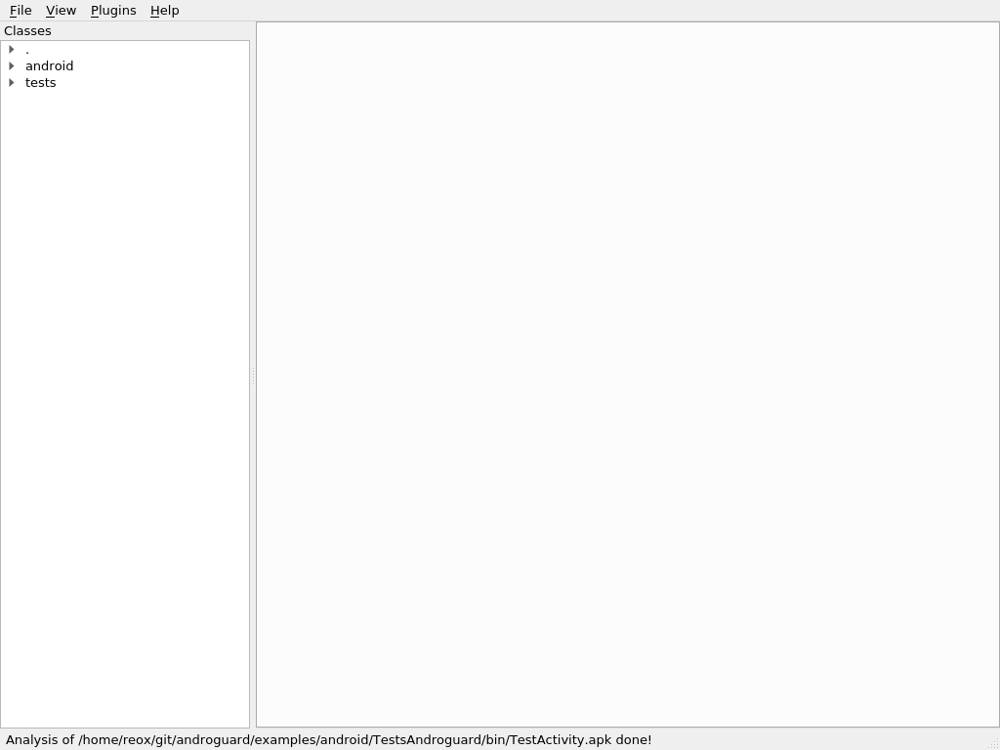
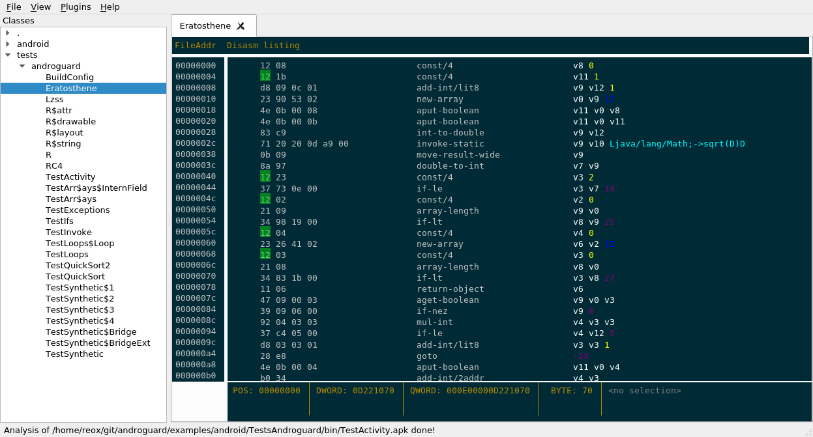
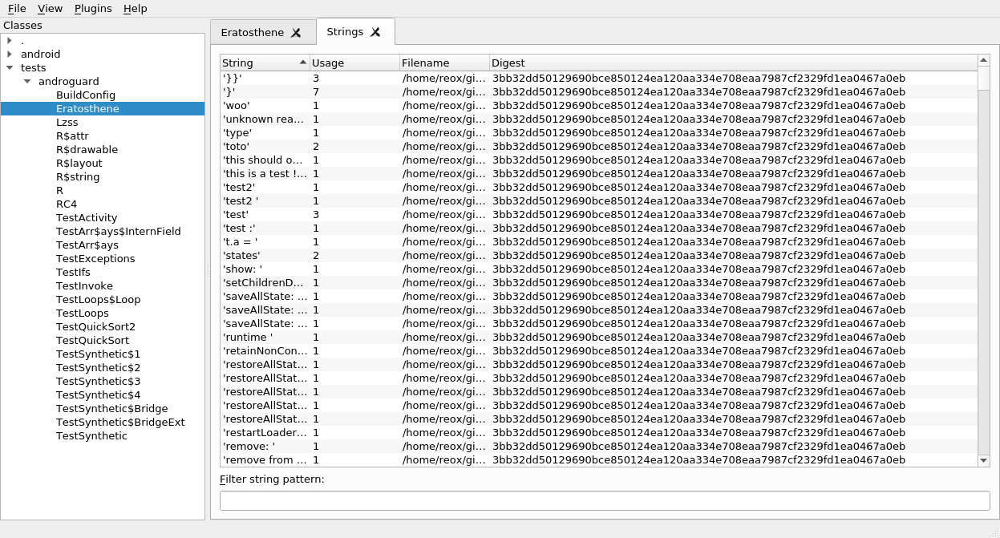
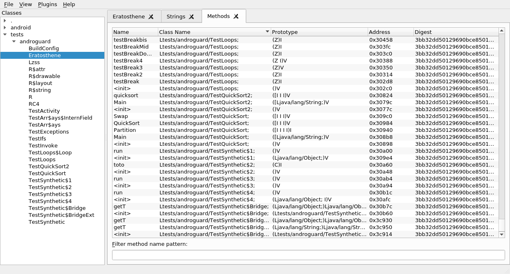
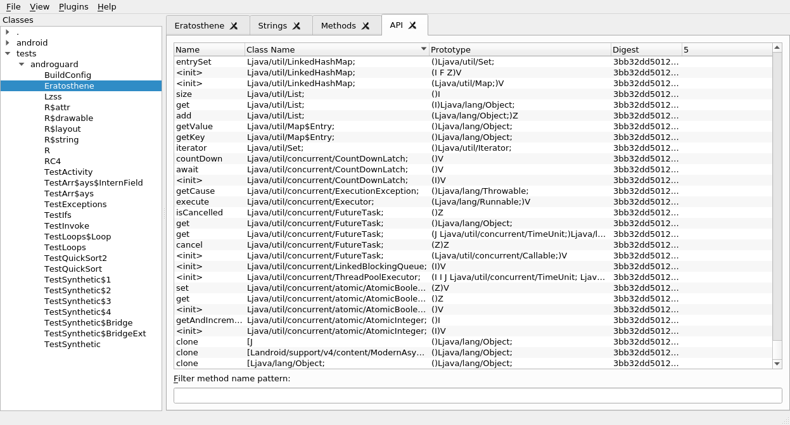
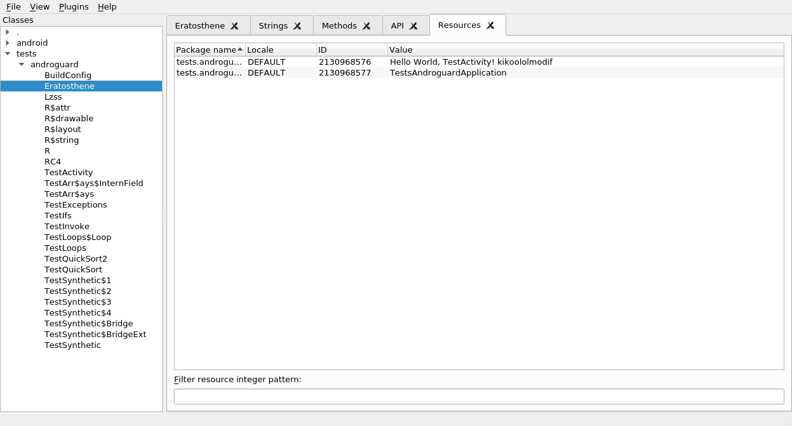

androguard gui - Androguard GUI
===============================

.. warning::

   The androgui is experimental and might not fully work!

.. program-output:: androguard gui --help

Examples
--------

The androguard gui currently has functions to show disassembled dalvik code,
print all strings, methods, API usage and resources.

It uses :class:`~androguard.sessions.Session` in order to resume the work later.

First, open up an APK using File, Open.
If everything has worked, you will see all classes found inside the APK in the
left tree view:

If you double click on one of the classes, you will get the disassembler view:

Under View, Strings you will find a list of all Strings inside the DEX file(s):

View, Methods shows all methods found in the DEX files(s):

Using View, API you will get a list of all API methods (or basically all
external Methods) which are used inside the APK:

At last, you can get a list of all string resources from the `resources.arsc`
file using View, Resources:

It is possible to add other APK or DEX files at any point using File, Add.
In order to save the current state of the GUI and resume later, just go to File,
Save and save the file as an `.ag` file.
To resume later, just open the file with File, Open again.

Plugin System
-------------

.. warning::

   Plugins are not tested and there are no examples right now!

The androguard gui supports plugins to be loaded.

A plugin is a python file which implements the following class:

.. code-block:: python

   class PluginEntry:
       def __init__(self, session):
           """
           Session is a :class:`~androguard.session.Session` object.
           """
           self.session = session

